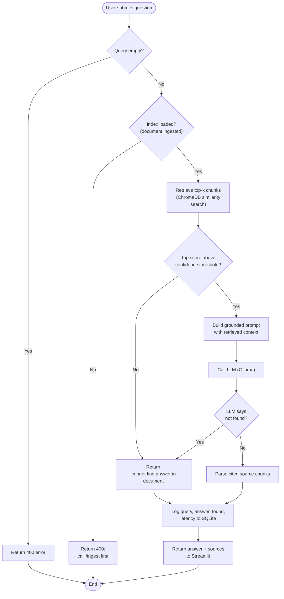

# RAG-based Document Q&A System with Analytics Dashboard

> One-paragraph summary: what this project does (RAG Q&A over the AWS Customer Agreement, FastAPI backend, SQL usage logging, Streamlit dashboard).

## Table of Contents
- [RAG-based Document Q\&A System with Analytics Dashboard](#rag-based-document-qa-system-with-analytics-dashboard)
  - [Table of Contents](#table-of-contents)
  - [Architecture Overview](#architecture-overview)
  - [Setup \& Run Instructions](#setup--run-instructions)
    - [Prerequisites](#prerequisites)
    - [Installation](#installation)
    - [Running the backend](#running-the-backend)
    - [Running the frontend](#running-the-frontend)
  - [Design Decisions \& Justifications](#design-decisions--justifications)
    - [Chunking Strategy](#chunking-strategy)
    - [Embedding Model](#embedding-model)
    - [Vector Store](#vector-store)
    - [Top-k Retrieval](#top-k-retrieval)
    - [LLM / Provider Choice](#llm--provider-choice)
    - [Handling Out-of-Scope Questions](#handling-out-of-scope-questions)
  - [API Reference](#api-reference)
    - [Request/Response examples](#requestresponse-examples)
    - [Error Handling](#error-handling)
  - [SQL Logging Schema](#sql-logging-schema)
  - [Analytics Queries](#analytics-queries)
  - [Frontend](#frontend)
  - [Demo](#demo)
  - [Assumptions \& Known Limitations](#assumptions--known-limitations)

## Architecture Overview


## Setup & Run Instructions

### Prerequisites
- Python version
- Ollama (or other LLM provider) running locally, model pulled
- `.env` variables required (list them, no real secrets)

### Installation
```bash
# clone, venv, install deps
git clone https://github.com/yinsights8/rag_chatbot.git
cd rag_chatbot 
python -m venv .venv
python -r requirements.txt
```

### Running the backend
```bash
# command to start FastAPI
uvicorn api:app --reload
```

### Running the frontend
```bash
# command to start Streamlit as a separate process
streamlit run streamlit_app.py
```

## Design Decisions & Justifications

### Chunking Strategy

- **Chunk size: 800 characters, overlap: 100 characters.** the optimal value for the k, chunk size and overlap was derived from the experiments conducted over the quries, tried multiple values for `TOP_K_VALUES = [4, 6, 8]`, `CHUNK_SIZES = [100, 500, 700]`, `CHUNK_OVERLAPS = [50, 100, 150]`, and found k=8, overlap=100 and size=700. however increasing chunk size would result in increase in token  that may affect the token cost and burn money. therefore, more advnaced character text spliter needed. [notebook](notebooks/topk_chunk_overlap_tuning.ipynb)
- these experiment generates the evaluation queries and perform the grid search over k, overlap and chunk sizes. and calculates the `recall_at_k`, and `mrr`.
- Parsing approach: structurel layout aware parsing requrird for the PDF since it is a legal document. therefore, the project uses the page-based extraction with PyMuPDF (`rag/ingestor.py`),
 then `RecursiveCharacterTextSplitter` (separators `\n\n`, `\n`, `. `, ` `)
  per page, so chunks never cross page boundaries. this prevents  spliting the words from the middle of the sentenc

### Embedding Model
- `sentence-transformers/all-MiniLM-L6-v2` was use as a embedding model, since this was the free, small and fastest embedding model for my laptop configuration.  

### Vector Store
- ChromaDB (or other) — as compaire to the FAISS, this vector store dosen't need to maintain the separate indexing pickel file. instead it handles automatically. also it is a free and opensouce library to stored text embeddings localy.

### Top-k Retrieval
- Grid search across top_k ∈ {2, 4, 6, 8} on the 23-query eval set — Recall@k goes up with k: 0.742 at 2, 0.822 at 4, 0.889 at 6, 0.923 at 8 (avg composite; see reports/fintuning_chunking.md). At the winning chunk_size/overlap, top_k=8 came out highest: composite 0.964 vs. 0.946 for top_k=6.

- 6 over 8 why?: Recall@k goes up with k almost by definition — more chunks, more chances to land on the right page. But that's a retrieval win, not a generation win. Every extra chunk gets concatenated into the prompt (rag/generator.py's build_prompt), and the generator has to deal with all of it:

1. noise: More chunks means more topically adjacent but irrelevant clauses sitting next to the right answer. An 8B local model (`llama3.1:latest` via Ollama) is more likely to hedge, "I don't see this explicitly stated...", when the answer is buried among extra boilerplate than when it's one of 6 tight chunks.
   
2. Latency:  More input tokens, slower local inference. Matters when you're logging latency_ms on every /ask call and want a clean analytics baseline.

3. Diminishing returns: top_k=6 captures 85% of top_k=8's composite (0.8519 vs. 0.8462, a 0.057 gap). Not worth the extra context on a 19-page, ~150-chunk corpus at chunk_size=500

### LLM / Provider Choice
- Openrouter and local llm via ollama. 

### Handling Out-of-Scope Questions
Layer 1: 
- if not chunks or max(c["score"] for c in chunks) <
  RETRIEVAL_CONFIDENCE_THRESHOLD:
      return NOT_FOUND_MESSAGE, []
  Before the LLM is ever called, the best retrieved chunk's cosine
  similarity score is checked against RETRIEVAL_CONFIDENCE_THRESHOLD
  (.env, default 0.3). If even the closest match is below that bar,
  the system short-circuits — no LLM call at all.

Layer 2 :
- Prompt-level grounding + explicit refusal instruction
  (SYSTEM_PROMPT, rag/generator.py:32)
  Answer questions ONLY using the provided context excerpts. If the
  answer cannot
  be found in the context, respond with exactly: "I cannot find the
  answer..."
  Do not make up facts. Do not use outside knowledge.
  This catches the case Layer 1 can't

A third, smaller mechanism, a citation parsing
  (parse_sources_used): the model is asked to declare which numbered
  sources it actually used. If it cites none (SOURCES_USED: none),
  that's treated as a second hallucination signal even if the answer
  text itself didn't trip `answer_not_found`.

Known gap: the audit also
  found the inverse failure, a genuinely answerable question ("Can
  AWS move customer content between regions without permission?",
  score=0.64) still got found=False because the retrieved chunk's
  text was fragmented across a chunk boundary, missing its
  grammatical lead-in.


## API Reference

| Endpoint | Method | Description |
|---|---|---|
| `/ingest` | POST | Processes and embeds the provided PDF |
| `/ask` | POST | Accepts a query, runs the RAG pipeline, returns answer + source, logs the call |
| `/analytics` | GET | Runs SQL analytics queries, returns results as JSON |

### Request/Response examples

**`POST /ingest`**
```json
// Request
{ "pdf_path": null }
```
```json
// Response 200
{ "message": "Indexed 159 chunks from instructions/AWS_Customer_Agreement.pdf", "chunks_indexed": 159 }
```
`pdf_path` is optional — omitting it (or passing `null`) falls back to the
default AWS Customer Agreement PDF.

**`POST /ask`** — answerable query
```json
// Request
{ "query": "What is the notice period for terminating this agreement?" }
```
```json
// Response 200
{
  "query": "What is the notice period for terminating this agreement?",
  "answer": "...",
  "found": true,
  "source_chunks": [
    { "text": "...", "page": 7, "score": 0.71 }
  ]
}
```

**`POST /ask`** — out-of-scope query
```json
// Request
{ "query": "Who is Batman?" }
```
```json
// Response 200
{
  "query": "Who is Batman?",
  "answer": "I cannot find the answer to this question in the provided document.",
  "found": false,
  "source_chunks": []
}
```
Note this is still a `200` — "not found" is a valid, successful answer from
the RAG system's perspective, not an API error.

**`GET /analytics`**
```json
// Response 200
{
  "most_frequent_questions": [{ "query": "What is the notice period...", "count": 4 }],
  "no_answer_queries": [{ "query": "Who is Batman?", "count": 1 }],
  "average_latency_ms": 842.3
}
```

### Error Handling

| Status | Condition | Where |
|---|---|---|
| 400 | Empty/whitespace-only `query` | `POST /ask` |
| 400 | `/ask` called before any document has been ingested | `POST /ask` |
| 404 | `pdf_path` does not exist on disk | `POST /ingest` |
| 500 | Unexpected error during ingestion or generation | `POST /ingest`, `POST /ask` |
| 500 | Unexpected error computing analytics | `GET /analytics` |

All error responses are `HTTPException`s with a plain-English `detail`
string — every endpoint wraps its logic in `try/except HTTPException: raise`
+ `except Exception:` so an unexpected internal error (e.g. the LLM endpoint
being unreachable) always degrades to a generic 500 message rather than
leaking a raw stack trace to the client.

## SQL Logging Schema

```sql
CREATE TABLE IF NOT EXISTS query_logs (
    id INTEGER PRIMARY KEY AUTOINCREMENT,
    query TEXT NOT NULL,
    answer TEXT NOT NULL,
    found INTEGER NOT NULL,
    top_score REAL,
    latency_ms REAL NOT NULL,
    created_at TEXT NOT NULL DEFAULT (datetime('now'))
);
CREATE INDEX IF NOT EXISTS idx_query_logs_query ON query_logs(query);
CREATE INDEX IF NOT EXISTS idx_query_logs_found ON query_logs(found);
```

SQLite, stored at `data/usage_logs.db` (`rag/db.py`). One row per `/ask`
call, written after generation completes regardless of outcome.

- `query` / `answer` — the raw text of both sides of the exchange; this is
  what "most frequently asked questions" groups on.
- `found` — a derived boolean (`0`/`1`) rather than re-parsing `answer` text
  every analytics call to figure out whether the system answered or
  declined. Indexed, since `get_no_answer_queries` filters on it.
- `top_score` — the best retrieval cosine-similarity score for that query,
  even when an answer was found. Not currently surfaced in `/analytics`, but
  kept so a future "low-confidence answers" report doesn't require a schema
  migration.
- `latency_ms` — wall-clock time for retrieval + generation, measured around
  the same code path the SQL aggregates over (`get_average_latency_ms`).
- `created_at` — defaults to the DB's own clock (`datetime('now')`) rather
  than app-server time, so log timestamps stay consistent even if logging
  ever happens from multiple processes.

`init_db()` runs `CREATE TABLE IF NOT EXISTS` on FastAPI startup — idempotent,
so restarting the server never wipes existing logs.

## Analytics Queries

All three live in `rag/db.py` and back `GET /analytics` directly.

**Most frequently asked questions**
```sql
SELECT query, COUNT(*) AS count FROM query_logs
GROUP BY query ORDER BY count DESC LIMIT ?
```
Groups identical query strings and ranks by frequency — the simplest
read of "what do people keep asking."

**Queries with no answer found**
```sql
SELECT query, COUNT(*) AS count FROM query_logs
WHERE found = 0 GROUP BY query ORDER BY count DESC LIMIT ?
```
Same shape as above, filtered to `found = 0`, surfaces both genuinely
out-of-scope questions and possible retrieval/chunking gaps worth
investigating (see `reports/retrieval_pipeline_audit.md` for an example of
the latter).

**Average response latency**
```sql
SELECT AVG(latency_ms) FROM query_logs
```
A single scalar across all logged calls; returns `0.0` if no rows exist yet
rather than `NULL`, so the Streamlit dashboard doesn't need a null-check.

## Frontend

`streamlit_app.py` is a single-file Streamlit app, run as its own process
(`streamlit run streamlit_app.py`) separate from the FastAPI server it
talks to the backend purely over HTTP via `requests`, against
`BASE_URL = "http://localhost:8000"`. No shared Python state between the two
processes; if the backend isn't running, both views catch
`requests.exceptions.RequestException` and show an inline error instead of
crashing the app.

A `st.radio` toggle switches between two views:
- **Chat** — a `st.chat_input` box backed by `st.session_state.messages`, so
  conversation history persists across reruns within a session. Each
  assistant turn renders the answer plus its cited `source_chunks` (page
  number + similarity score + snippet) via a shared `render_sources` helper,
  so users can see *why* the model answered the way it did, not just the
  answer text.
- **Analytics** — calls `GET /analytics` and renders `average_latency_ms` as
  a `st.metric`, then both frequency tables (`most_frequent_questions`,
  `no_answer_queries`) as a `st.dataframe` + `st.bar_chart` pair, falling
  back to a plain message when no queries have been logged yet.

## Demo

<!-- TODO: record a 2-3 min screen capture showing a question being asked
end-to-end (Chat view, including a source citation) and the Analytics view
populated with real logged queries, then link or embed it here. Not yet
recorded. -->

## Assumptions & Known Limitations

<!-- e.g. single static document, no incremental re-ingestion, local-only LLM, etc. -->